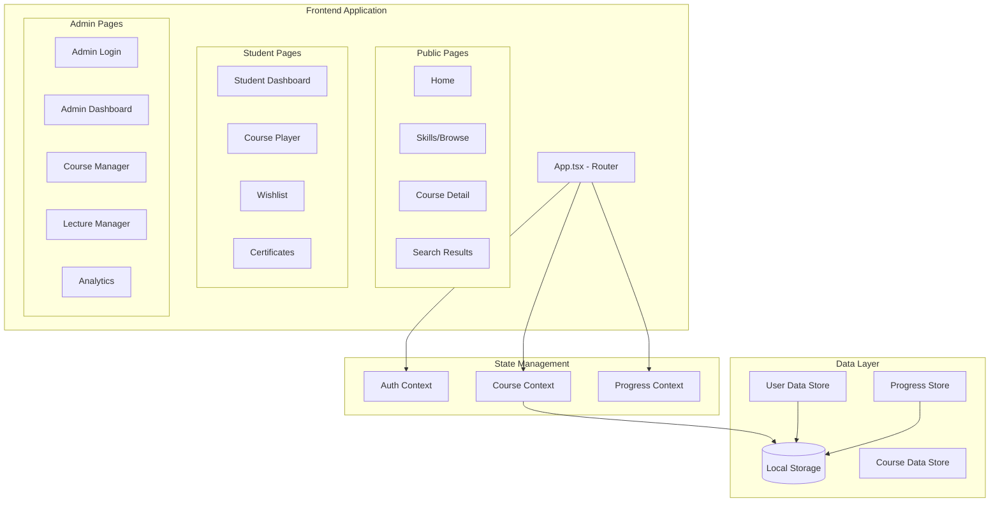
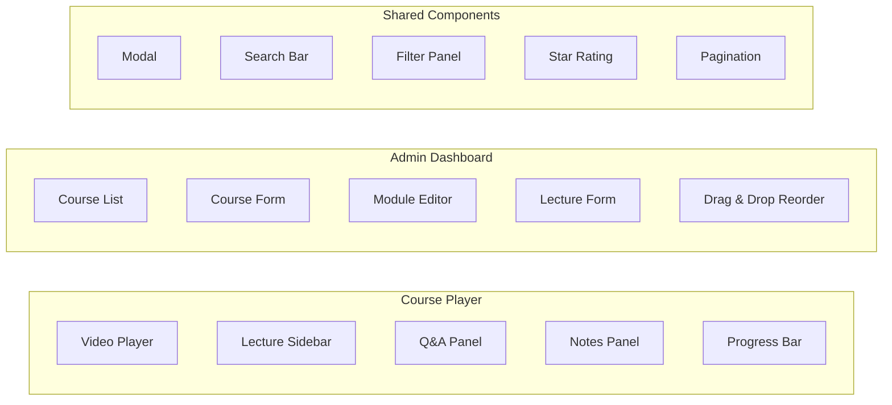

# Design Document: LMS Platform Enhancement

## Overview

This design document outlines the architecture and implementation approach for transforming UpskillHub from a course catalog into a full-featured Learning Management System (LMS). The enhancement adds admin capabilities, a course player with video delivery, Q&A discussions, progress tracking, and various student engagement features.

The system follows a client-side React architecture with local storage for data persistence (with the option to migrate to a backend API in the future). The design prioritizes modularity, allowing features to be developed incrementally while maintaining a cohesive user experience.

## Architecture

### High-Level Architecture



### Component Architecture



## Components and Interfaces

### New Page Components

| Component | Path | Description |
|-----------|------|-------------|
| `AdminLogin` | `/admin/login` | Admin authentication page |
| `AdminDashboard` | `/admin` | Admin overview with quick stats |
| `AdminCourses` | `/admin/courses` | Course management CRUD |
| `AdminLectures` | `/admin/courses/:id/lectures` | Lecture/module management |
| `AdminAnalytics` | `/admin/analytics` | Platform analytics dashboard |
| `CoursePlayer` | `/learn/:courseId` | Video player with sidebar |
| `StudentDashboard` | `/my-courses` | Enrolled courses view |
| `WishlistPage` | `/wishlist` | Saved courses |
| `CertificatesPage` | `/certificates` | Earned certificates |
| `SearchResults` | `/search` | Advanced search with filters |

### New Shared Components

| Component | Purpose |
|-----------|---------|
| `VideoPlayer` | HTML5 video player with custom controls |
| `LectureSidebar` | Collapsible module/lecture navigation |
| `QASection` | Questions and answers thread |
| `NotesEditor` | Note-taking with timestamp linking |
| `CourseForm` | Reusable course create/edit form |
| `LectureForm` | Lecture create/edit form |
| `ModuleAccordion` | Expandable module with drag-drop |
| `StarRating` | Interactive star rating input |
| `ReviewCard` | Display individual review |
| `ProgressRing` | Circular progress indicator |
| `SearchFilters` | Category, level, price filters |
| `CertificateView` | Certificate display and download |
| `AnnouncementBanner` | Course announcement display |

### Context Providers

```typescript
// AuthContext - manages user and admin authentication
interface AuthContextType {
  user: User | null;
  admin: Admin | null;
  isAuthenticated: boolean;
  isAdmin: boolean;
  login: (email: string, password: string) => Promise<void>;
  adminLogin: (email: string, password: string) => Promise<void>;
  logout: () => void;
  register: (userData: RegisterData) => Promise<void>;
}

// CourseContext - manages course data operations
interface CourseContextType {
  courses: Course[];
  getCourse: (id: string) => Course | undefined;
  createCourse: (course: CourseInput) => Course;
  updateCourse: (id: string, updates: Partial<Course>) => Course;
  deleteCourse: (id: string) => void;
  addModule: (courseId: string, module: ModuleInput) => Module;
  addLecture: (moduleId: string, lecture: LectureInput) => Lecture;
  reorderModules: (courseId: string, moduleIds: string[]) => void;
  reorderLectures: (moduleId: string, lectureIds: string[]) => void;
}

// ProgressContext - manages student progress
interface ProgressContextType {
  getProgress: (courseId: string) => CourseProgress;
  markLectureComplete: (courseId: string, lectureId: string) => void;
  updateWatchPosition: (lectureId: string, position: number) => void;
  getCourseCompletionPercentage: (courseId: string) => number;
}
```

## Data Models

### Extended Course Model

```typescript
interface Course {
  id: string;
  title: string;
  instructor: string;
  instructorId: string;
  rating: number;
  reviewCount: number;
  students: number;
  price: number;
  originalPrice?: number;
  category: Category;
  image: string;
  duration: string;
  totalLectures: number;
  level: 'Beginner' | 'Intermediate' | 'Advanced';
  description: string;
  whatYouWillLearn: string[];
  prerequisites: string[];
  modules: Module[];
  lastUpdated: string;
  language: string;
  status: 'draft' | 'published' | 'archived';
  createdAt: string;
  updatedAt: string;
}

interface Module {
  id: string;
  courseId: string;
  title: string;
  order: number;
  lectures: Lecture[];
}

interface Lecture {
  id: string;
  moduleId: string;
  courseId: string;
  title: string;
  description?: string;
  videoUrl: string;
  duration: number; // in seconds
  order: number;
  isFree: boolean; // preview lectures
  resources?: Resource[];
}

interface Resource {
  id: string;
  title: string;
  type: 'pdf' | 'link' | 'file';
  url: string;
}
```

### User and Progress Models

```typescript
interface User {
  id: string;
  name: string;
  email: string;
  avatar?: string;
  enrolledCourses: string[];
  wishlist: string[];
  createdAt: string;
}

interface Admin {
  id: string;
  name: string;
  email: string;
  role: 'admin' | 'instructor';
}

interface CourseProgress {
  courseId: string;
  userId: string;
  completedLectures: string[];
  lastWatchedLectureId: string;
  lastWatchedPosition: number; // seconds
  progressPercentage: number;
  startedAt: string;
  completedAt?: string;
}

interface LectureProgress {
  lectureId: string;
  watchedSeconds: number;
  completed: boolean;
  lastPosition: number;
}
```

### Q&A Models

```typescript
interface Question {
  id: string;
  courseId: string;
  lectureId?: string;
  userId: string;
  userName: string;
  title: string;
  body: string;
  upvotes: number;
  upvotedBy: string[];
  answers: Answer[];
  createdAt: string;
  updatedAt: string;
}

interface Answer {
  id: string;
  questionId: string;
  userId: string;
  userName: string;
  isInstructor: boolean;
  body: string;
  upvotes: number;
  upvotedBy: string[];
  createdAt: string;
}
```

### Review and Notes Models

```typescript
interface Review {
  id: string;
  courseId: string;
  userId: string;
  userName: string;
  rating: number;
  comment?: string;
  createdAt: string;
  helpful: number;
}

interface Note {
  id: string;
  userId: string;
  courseId: string;
  lectureId: string;
  content: string;
  timestamp?: number; // video timestamp in seconds
  createdAt: string;
  updatedAt: string;
}

interface Bookmark {
  id: string;
  userId: string;
  courseId: string;
  lectureId: string;
  timestamp: number;
  label?: string;
  createdAt: string;
}
```

### Certificate and Announcement Models

```typescript
interface Certificate {
  id: string;
  uniqueCode: string;
  userId: string;
  userName: string;
  courseId: string;
  courseTitle: string;
  instructor: string;
  completedAt: string;
  issuedAt: string;
  verificationUrl: string;
}

interface Announcement {
  id: string;
  courseId: string;
  title: string;
  body: string;
  createdAt: string;
  readBy: string[]; // user IDs who have read
}
```

### Analytics Models

```typescript
interface CourseAnalytics {
  courseId: string;
  totalEnrollments: number;
  activeStudents: number;
  completionRate: number;
  averageRating: number;
  totalRevenue: number;
  averageWatchTime: number;
}

interface PlatformAnalytics {
  totalUsers: number;
  totalEnrollments: number;
  totalRevenue: number;
  activeUsersToday: number;
  coursesPublished: number;
  averageCompletionRate: number;
}
```


## Correctness Properties

*A property is a characteristic or behavior that should hold true across all valid executions of a system-essentially, a formal statement about what the system should do. Properties serve as the bridge between human-readable specifications and machine-verifiable correctness guarantees.*

Based on the acceptance criteria analysis, the following correctness properties must be validated through property-based testing:

### Property 1: Course Data Round-Trip Consistency
*For any* valid Course object with modules and lectures, serializing to JSON and then deserializing should produce an equivalent Course object with all associations intact.
**Validates: Requirements 7.5, 7.6**

### Property 2: Hierarchical Data Integrity
*For any* created lecture, the lecture must be associated with exactly one module, and that module must be associated with exactly one course. Similarly, for any created module, it must belong to exactly one course.
**Validates: Requirements 7.1, 7.2**

### Property 3: Course CRUD Operations Consistency
*For any* valid course input, creating a course should result in the course appearing in the course list, and updating a course should persist all changes, and deleting a course should remove it from the list.
**Validates: Requirements 2.3, 2.6, 2.7**

### Property 4: Course Form Validation
*For any* course form submission with missing required fields (title, instructor, category, or level), the system should reject the submission and return validation errors for each missing field.
**Validates: Requirements 2.4**

### Property 5: Lecture CRUD Operations Consistency
*For any* valid lecture input and target module, creating a lecture should associate it with the module, and deleting a lecture should remove it from the module and decrement the lecture count.
**Validates: Requirements 3.4, 3.7**

### Property 6: Module Cascade Deletion
*For any* module with associated lectures, deleting the module should remove both the module and all its lectures from the course.
**Validates: Requirements 3.8**

### Property 7: Lecture Reordering Persistence
*For any* module and any permutation of its lecture IDs, reordering lectures should persist the new sequence such that subsequent retrieval returns lectures in the new order.
**Validates: Requirements 3.5**

### Property 8: Module Reordering Persistence
*For any* course and any permutation of its module IDs, reordering modules should persist the new sequence such that subsequent retrieval returns modules in the new order.
**Validates: Requirements 3.6**

### Property 9: Progress Calculation Accuracy
*For any* course with N lectures and M completed lectures (where M <= N), the progress percentage should equal (M / N) * 100, and completing all lectures should result in 100% progress.
**Validates: Requirements 4.3, 5.2, 5.5**

### Property 10: Progress Persistence Across Navigation
*For any* lecture with a saved watch position, navigating away and returning should restore the saved position.
**Validates: Requirements 4.5, 5.3**

### Property 11: Enrollment Access Control
*For any* course and user, if the user is enrolled in the course, they should have access to the course player; if not enrolled, they should be redirected to the enrollment page.
**Validates: Requirements 4.1, 4.6**

### Property 12: Q&A Question Validation
*For any* question submission where the title or body consists entirely of whitespace characters, the submission should be rejected and the question list should remain unchanged.
**Validates: Requirements 6.3**

### Property 13: Q&A Search Filtering
*For any* search term and set of questions, the search results should contain only questions where the title or body contains the search term (case-insensitive).
**Validates: Requirements 6.5**

### Property 14: Q&A Upvote Consistency
*For any* question or answer, upvoting should increment the vote count by exactly 1, and the voter's ID should be added to the upvotedBy list.
**Validates: Requirements 6.6**

### Property 15: Review Rating Validation
*For any* review submission without a star rating (1-5), the submission should be rejected and no review should be created.
**Validates: Requirements 9.3**

### Property 16: Average Rating Calculation
*For any* course with a set of reviews, the displayed average rating should equal the arithmetic mean of all review ratings, rounded to one decimal place.
**Validates: Requirements 9.5**

### Property 17: Review Eligibility Threshold
*For any* user and course, the review submission option should be enabled if and only if the user's progress in that course is at least 50%.
**Validates: Requirements 9.1**

### Property 18: Course Search Matching
*For any* search term and course catalog, the search results should include all courses where the term appears in the title, description, or instructor name (case-insensitive).
**Validates: Requirements 13.1**

### Property 19: Course Filter Correctness
*For any* filter criteria (category, level, or price range) and course catalog, the filtered results should contain only courses that satisfy all applied filter conditions (AND logic).
**Validates: Requirements 13.2, 13.3, 13.4, 13.6**

### Property 20: Course Sort Ordering
*For any* sort criteria (rating, popularity, newest, price) and course list, the sorted results should be ordered according to the selected criteria in the correct direction.
**Validates: Requirements 13.5**

### Property 21: Wishlist Operations Consistency
*For any* user and course, adding to wishlist should include the course in the user's wishlist, and removing should exclude it from the wishlist.
**Validates: Requirements 14.1, 14.3**

### Property 22: Bookmark Timestamp Accuracy
*For any* bookmark created at a specific video timestamp, clicking the bookmark should navigate to that lecture and seek to within 1 second of the saved timestamp.
**Validates: Requirements 10.1, 10.4**

### Property 23: Notes Association Integrity
*For any* note created for a lecture, the note should be associated with the correct lecture and course, and retrieving notes for that course should include the created note.
**Validates: Requirements 10.2, 10.3**

### Property 24: Certificate Generation Trigger
*For any* user who completes 100% of a course's lectures, a certificate should be generated containing the user's name, course title, completion date, and a unique certificate ID.
**Validates: Requirements 11.1, 11.2**

### Property 25: Announcement Read Status Tracking
*For any* announcement and user, viewing the announcement should add the user's ID to the readBy list, and subsequent checks should show the announcement as read for that user.
**Validates: Requirements 12.4**

### Property 26: Enrolled Courses Filter Accuracy
*For any* user with enrolled courses and filter status (in-progress, completed, not-started), the filtered list should contain only courses matching the selected status based on progress data.
**Validates: Requirements 8.4**

### Property 27: Video Playback Speed Adjustment
*For any* valid playback speed (0.5x, 1x, 1.25x, 1.5x, 2x), setting the playback speed should result in the video playing at the selected rate.
**Validates: Requirements 16.2**

## Error Handling

### Client-Side Validation Errors
- Form validation errors display inline with affected fields
- Empty required fields highlighted with red border and error message
- Invalid data formats (email, URL) show specific format requirements

### API/Storage Errors
- Network failures show retry option with user-friendly message
- Local storage quota exceeded prompts data cleanup
- Corrupted data triggers recovery from backup or reset option

### Authentication Errors
- Invalid credentials show generic "Invalid email or password" message
- Session expiration redirects to login with return URL preserved
- Unauthorized access attempts redirect to appropriate login page

### Video Player Errors
- Video load failures show fallback message with retry option
- Unsupported format displays browser compatibility message
- Buffering issues show loading indicator with timeout handling

## Testing Strategy

### Unit Testing Approach
Unit tests will be written using Vitest to verify specific examples and edge cases:

- Component rendering tests for all new pages and components
- Form validation logic tests
- Utility function tests (date formatting, duration calculation)
- Context provider state management tests
- Route protection and navigation tests

### Property-Based Testing Approach
Property-based tests will be written using **fast-check** library for TypeScript/JavaScript to verify universal properties:

- Each correctness property from the design document will have a corresponding property-based test
- Tests will run a minimum of 100 iterations per property
- Each test will be tagged with format: `**Feature: lms-platform-enhancement, Property {number}: {property_text}**`
- Generators will be created for:
  - Valid Course objects with nested modules and lectures
  - User objects with various enrollment states
  - Question and Answer objects
  - Review objects with ratings
  - Search queries and filter combinations

### Test Organization
```
src/
├── __tests__/
│   ├── unit/
│   │   ├── components/
│   │   ├── contexts/
│   │   ├── utils/
│   │   └── pages/
│   └── properties/
│       ├── course.property.test.ts
│       ├── progress.property.test.ts
│       ├── qa.property.test.ts
│       ├── search.property.test.ts
│       ├── review.property.test.ts
│       └── generators/
│           ├── course.generator.ts
│           ├── user.generator.ts
│           └── qa.generator.ts
```

### Integration Testing
- End-to-end flows for critical user journeys
- Admin course creation to student enrollment flow
- Progress tracking through course completion
- Q&A question submission and answer flow

